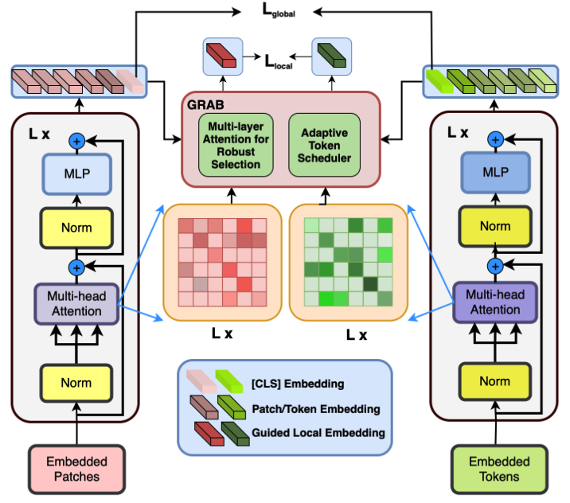

## 📄 ITSELF: Attention Guided Fine-Grained Alignment for Vision–Language Retrieval (WACV 2026 (Oral))

[Tien-Huy Nguyen](https://scholar.google.com/citations?hl=en&user=gSRGW3gAAAAJ) <sup>1,2</sup>, [Huu-Loc Tran](https://scholar.google.com/citations?user=1xlRrhMAAAAJ&hl=vi)<sup>1,2</sup>, Thanh Duc Ngo<sup>1,2</sup>

<sup>1</sup> University of Information Technology  
<sup>2</sup> Vietnam National University - HCM  

<p align="left">
  <a href="https://arxiv.org/pdf/2601.01024v1"></a>
  <a href="https://huggingface.co/GenAI4ELab"></a>
  <a href="https://trhuuloc.github.io/itself/"></a>
  <a href="https://drive.google.com/file/d/1H6QSuwBRGqEni7Zk1ZIaBk-iv0BTC2cQ/view?usp=share_link"></a>
  <a href="https://www.youtube.com/watch?v=afy9iBuSDM8"></a>
  
</p>

## News
- [03/08/2026] Check out our checkpoints, now available on [[Link](https://huggingface.co/GenAI4ELab)]. 

- [01/22/2026] Our paper has been accepted for an oral presentation (Acceptance rate ~3.5%).

- [11/11/2025] Our paper has been accepted at WACV 2026.


## Highlights
- We propose ITSELF framework. A novel attention-guided implicit local alignment framework, ITSELF with GRAB that leverages encoder attention to mine fine-grained discriminativecues and reinforce global text-image alignment without additional supervision.
- Robust Selection & Scheduling. We propose MARS, which fuses attention across layers and performs diversity-aware top-k selection; and ATS, which anneals the retention budget from coarse to fine over training to stabilize learning and prevent early information loss.
- Strong Empirical Results: Extensive experiments establish SOTA performance on 3 widely used TBPS benchmarks and improved cross-dataset generalization, confirming the effectiveness and robustness of our approach.


<p align="center">
  
</p> 


## Citation 
If you find this repository useful, please use the following BibTeX entry for citation.

```
@misc{nguyen2026itselfattentionguidedfinegrained,
      title={ITSELF: Attention Guided Fine-Grained Alignment for Vision-Language Retrieval}, 
      author={Tien-Huy Nguyen and Huu-Loc Tran and Thanh Duc Ngo},
      year={2026},
      eprint={2601.01024},
      archivePrefix={arXiv},
      primaryClass={cs.CV},
      url={https://arxiv.org/abs/2601.01024}, 
}
```

## License

This project is released under the MIT license. 
